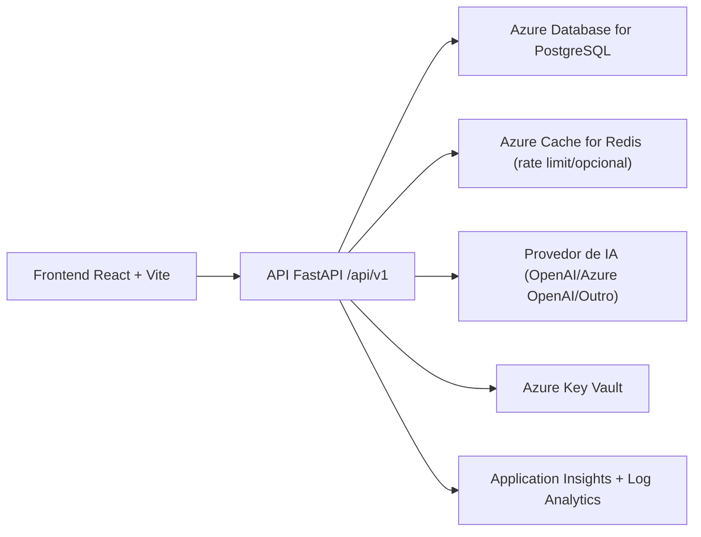

# 2) Arquitetura TO-BE (Azure)

## 2.1 Visão macro

## 2.2 Componentes

### Frontend
- React + TypeScript + Vite.
- Cliente HTTP tipado (`fetch`/`axios`) para `api/v1`.
- Feature flag de transição: `VITE_FONTE_DADOS` (`supabase`, `api`, `hibrido`).

### Backend
- FastAPI com:
  - Pydantic para contratos de entrada/saída.
  - SQLAlchemy 2.x para ORM.
  - Alembic para migrations.
  - JWT access + refresh token.
  - RBAC por role (`coordinator`, `teacher`, `student`).
  - Rate limit e proteção básica.
  - Padronização de erro (`codigo`, `mensagem`, `detalhes`, `correlation_id`).

### Banco
- Azure Database for PostgreSQL.
- Nomenclatura de tabelas em português (escopo definido em `docs/dados/04-modelo-dados-dicionario.md`).
- Índices para consultas por escola/período e ranking.

### Infra
- Opção A: Azure App Service (simples operação).
- Opção B: Azure Container Apps (maior flexibilidade/runtime).
- Segredos: Azure Key Vault com injeção em variáveis de ambiente.

### Observabilidade
- Logs estruturados JSON.
- Métricas (latência, taxa de erro, throughput).
- Traces distribuídos (OpenTelemetry + App Insights).
- Alertas para erro 5xx, latência p95, falhas de login, tentativas suspeitas.

## 2.3 Segurança e governança

- JWT assinado (chave rotacionável).
- Refresh tokens persistidos com hash.
- CORS explícito por ambiente.
- Rate limit por IP e por usuário autenticado.
- Auditoria para ações críticas (alteração de papel, escola, deleções em massa).
- LGPD mínimo:
  - classificação de dados pessoais;
  - retenção configurável;
  - descarte/anomização por janela.

## 2.4 Decisões de padronização

- Timezone padrão: `America/Sao_Paulo`.
- Datas:
  - `entry_date` em ISO `YYYY-MM-DD`;
  - `month` normalizado para `YYYY-MM`.
- Arredondamento:
  - financeiro: 2 casas;
  - métricas ambientais: 2 casas.
- Política de edição retroativa proposta:
  - janela de 60 dias para edição livre;
  - após 60 dias, somente `coordinator` com auditoria obrigatória.
